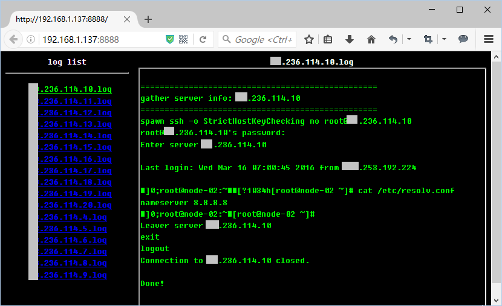

execute job on multiple remote hosts, view the result friendly
===========================================================

<!-- TOC depthFrom:1 depthTo:6 withLinks:1 updateOnSave:1 orderedList:0 -->

- [feature](#feature)
- [quick start](#quick-start)
	- [prepare](#prepare)
		- [create config](#create-config)
		- [create host_list file](#create-hostlist-file)
	- [use run.sh](#use-runsh)
		- [show usage](#show-usage)
		- [execute command](#execute-command)
		- [process result](#process-result)
		- [view raw result in web browser](#view-raw-result-in-web-browser)
- [extend example](#extend-example)
	- [add cmd file](#add-cmd-file)
	- [add cmd handler](#add-cmd-handler)
	- [use new cmd](#use-new-cmd)

<!-- /TOC -->
# feature

- batch execute job, store log to local
- view result
	- process result format
	- view raw result in web ui


**web ui**




# quick start

## prepare

### create config

> create etc/config, set ssh account in it

```
//for example
$ cat etc/config
	# for executor.sh
	REMOTE_USERNAME="root"
	REMOTE_PASSWORD="aaa123aa"
	REMOTE_PROMPT="*]#"
	#for run.sh
	MAX_NPROC=20
	DELAY_SEC=1

// variable start with `REMOTE_` is for ssh to remote host
// variable `MAX_NPROC` and `DELAY_SEC` is for limit concurrent task
```

### create host_list file

> create a host_list in host/, see host/example.lst.template

```
//for example
$ cat host/test.lst
	192.168.1.2
	192.168.1.3
```

## use run.sh

### show usage
```
$ ./run.sh

	====================================================================================
	usage: ./run.sh <action> [option]
	------------------------------------------------------------------------------------
	<action>:
	  exec    <host_list> <cmd_dir>             # batch execute command
	  process <host_list> <cmd_dir> <log_dir>   # process result
	  web     <host_list> <cmd_dir> <log_dir>   # start a web server to view raw result
	====================================================================================

	Available <host_list>:
	------------------------------------------------------------------------------------
	test	(   2 hosts )
	all	(  17 hosts )

	Available <cmd_dir>:
	------------------------------------------------------------------------------------
	checkdns/  checkimaged/  checknetwork/	gather_info/
```

### execute command
```
$ ./run.sh exec test checkdns
	...
	================================================================================
	To process result, please run:
	  ./run.sh process                                 # always process 'log/latest'
	  or
	  ./run.sh process test checkdns 20160319T120804

	To view raw result in web browser, please run:
	  ./run.sh web
	  or
	  ./run.sh web test checkdns 20160319T120804
	================================================================================

	############### Summary ###############
	HOST LIST : host/test.lst
	CMD FILE  : cmd/checkdns/cmd.exp
	---------------------------------------
	MAX_NPROC : 20
	DELAY_SEC : 1
	---------------------------------------
	START_TIME: 2016-03-19 12:08:04
	END_TIME  : 2016-03-19 12:08:08
	DURATION  : 4 (seconds)
	---------------------------------------
	JOB_TOTAL : 2
	  SUCCESS   : 2
	  FAIL      : 0
	#######################################

	All Done!
```

### process result
```
//for example
$ ./run.sh process
or
$ ./run.sh process test checkdns 20160319T002355
	------------------------------------ result ----------------------------------
	Enter server 192.168.1.2|nameserver 8.8.8.8
	Enter server 192.168.1.3|nameserver 8.8.8.8
	------------------------------------------------------------------------------
```

### view raw result in web browser

```
$ ./run.sh web
or
$ ./run.sh web test checkdns 20160319T002355
	serving at port 8888

// open http://<host_ip>:8888 in web browser
```


# extend example
> check all host's dns server

## add cmd file
```
//create new cmd file, filename should always be 'cmd.exp'
$ cat cmd/checkdns/cmd.exp
  expect "*\]#"
  send "cat /etc/resolv.conf\n"
```

## add cmd handler

```
//create new handler for process result, filename should always be 'handler.sh'
$ cat cmd/checkdns/handler.sh
  #!/bin/bash
  # this script is used for process result(process.sh will invoke this file)
  LOG_FILE="$1"
  cat ${LOG_FILE} | grep -E "(Enter|nameserver)" |  tr '\n' '|' | sed -e 's/|$/\n/'
```

## use new cmd

> run.sh will autoscan all cmd in cmd dir, so then new cmd will occur in 'Available <cmd_dir>' list
