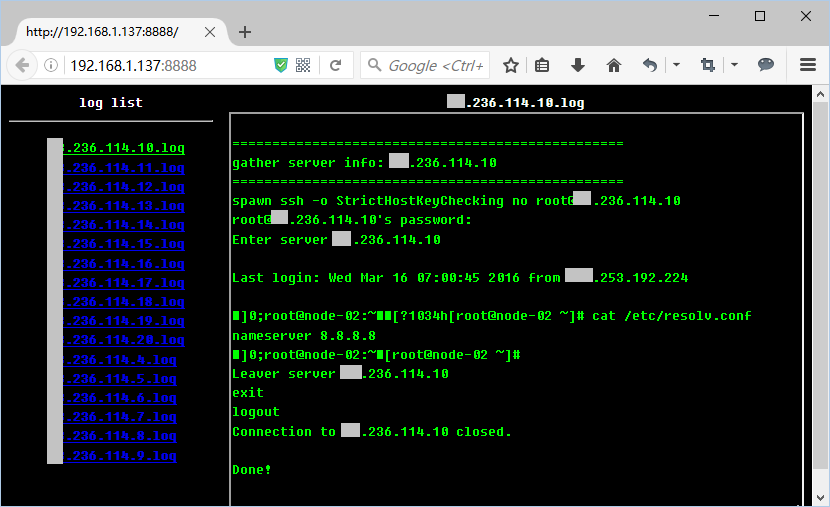

<!-- TOC depthFrom:1 depthTo:6 withLinks:1 updateOnSave:1 orderedList:0 -->

- [prepare](#prepare)
	- [create config](#create-config)
	- [create host_list file](#create-hostlist-file)
	- [create cmd file](#create-cmd-file)
- [batch run cmd](#batch-run-cmd)
- [view result](#view-result)
- [extend example](#extend-example)
	- [add config file](#add-config-file)
	- [create host_list file](#create-hostlist-file)
	- [add cmd file](#add-cmd-file)
	- [add cmd handler](#add-cmd-handler)
	- [start batch execute](#start-batch-execute)
	- [process result](#process-result)
	- [view raw result](#view-raw-result)

<!-- /TOC -->

# prepare

## create config

> create etc/config, set ssh account in it

## create host_list file

> create a host_list in host/, see host/example.lst.template

## create cmd file

> create a cmd file in cmd/, see cmd/example.exp.template

# batch run cmd
```
//show usage
$ ./fetch.sh
  Usage: ./fetch.sh <host_list> <cmd>

  Available host_list:
  --------------------------
  all
  test

  Available cmd:
  --------------------------
  gather_info

//run
$ ./fetch.sh all gather_info
```

# view result

> 1)view raw result data in `log/latest` dir
> 2)run web server view html result

```
//start simple web server
$ ./startsrv.sh
  /home/xjimmy/my-devops/expect/log/latest
  serving at port 8888

//open http://x.x.x.x:8888 to view result
```

# extend example
> check all host's dns server

## add config file
```
$ cat etc/config
USERNAME="root"
PASSWORD="xxxxxxxxx"
```

## create host_list file
```
//create new host_list
$ cat host/all.lst
  x.236.114.4
  x.236.114.5
  x.236.114.6
  x.236.114.7
```

## add cmd file
```
//create new cmd file
$ cat cmd/checkdns.exp
  expect "*\]#"
  send "cat /etc/resolv.conf\n"
```

## add cmd handler

> this file is required for process.sh

```
//create new handler for process result
$ cat cmd/checkdns.handler
  #!/bin/bash
  # this script is used for process result(process.sh will invoke this file)
  LOG_FILE="$1"
  cat ${LOG_FILE} | grep -E "(Enter|nameserver)" |  tr '\n' '|' | sed -e 's/|$/\n/'
```

## start batch execute
```
//show usage
./fetch.sh
  Usage: ./fetch.sh <host_list> <cmd>

  Available host_list:
  --------------------------
  all

  Available cmd:
  --------------------------
  checkdns


//start execute
$ ./fetch.sh all checkdns
  =================================================
  gather server info: x.236.114.15
  =================================================
  ...
  All Done!
  ================================================================================
  Please
    run ./process.sh to process result
    or
    run ./startsrv.sh to start a web server, then view raw result in web browser
  ================================================================================
```

## process result
```
$ ./process.sh
  Enter server x.236.114.4|nameserver 8.8.8.8
  Enter server x.236.114.5|nameserver 8.8.8.8
  Enter server x.236.114.6|nameserver 8.8.8.8
  Enter server x.236.114.7|nameserver 8.8.8.8
  Enter server x.236.114.8|nameserver 8.8.8.8
  Enter server x.236.114.9|nameserver 8.8.8.8
```

## view raw result

> raw result is under `log/latest` dir

```
//start web server
$ ./startsrv.sh
  /home/xjimmy/my-devops/expect/log/latest
  serving at port 8888
  ...

//open http://host_ip:8888 in web browser to view result
```

